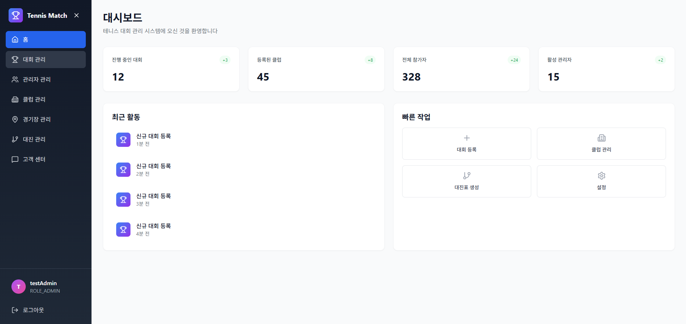
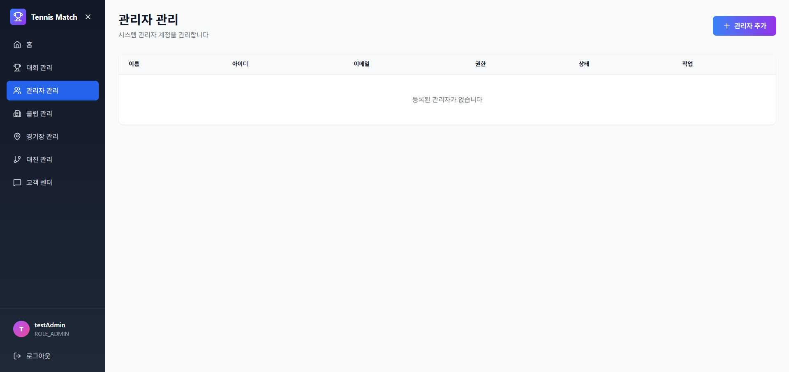

# 🎾 Tennis Match Admin Dashboard

테니스 대회를 개최하고 인원을 모집하는 관리자 대시보드 시스템입니다.


<!-- # TODO: 스크린샷 추가 -->
## 📸 스크린샷
<br>
<br>
<br>

---

## 📖 프로젝트 소개

Tennis Match Admin은 테니스 대회의 전반적인 운영을 관리하는 웹 기반 관리자 시스템입니다.

### 🎯 주요 목적
- 테니스 대회 개최 및 관리
- 참가자 모집 및 관리
- 클럽/협회 관리
- 경기장 및 대진표 관리
- 관리자 권한별 접근 제어

### ✨ 주요 기능

#### 🔐 인증 및 권한 관리
- 세션 기반 관리자 로그인/로그아웃
- 4단계 권한 시스템 (ADMIN, CHIEF_MANAGER, MANAGER, STAFF)
- 권한별 기능 접근 제어

#### 👥 관리자 관리
- 관리자 계정 생성 및 조회
- 임시 비밀번호 자동 생성
- 권한별 필터링 (활성/비활성 상태)
- 관리자 프로필 조회 및 수정

#### 🏢 클럽 관리
- 클럽/협회 등록 및 관리
- 클럽 정보 수정 및 삭제
- 클럽 소속 관리자 연동

#### 📊 대시보드
- 실시간 통계 정보
- 최근 활동 로그
- 빠른 작업 바로가기

#### 🚧 개발 예정
- 대회 관리 (생성, 수정, 삭제, 참가자 관리)
- 경기장 관리
- 대진표 생성 및 관리
- 고객 센터 (문의 관리)

---

## 🏗️ 프로젝트 구조

```
tennis-match-admin/
├── public/                          # 정적 파일
├── src/
│   ├── api/
│   │   └── index.js                # API 클라이언트 (백엔드 통신)
│   ├── components/
│   │   ├── common/
│   │   │   ├── Sidebar.jsx         # 네비게이션 사이드바
│   │   │   └── Loading.jsx         # 로딩 인디케이터
│   │   ├── layout/
│   │   │   └── DashboardLayout.jsx # 대시보드 레이아웃 래퍼
│   │   └── modals/
│   │       └── CreateAdminModal.jsx # 관리자 생성 모달
│   ├── pages/
│   │   ├── LoginPage.jsx           # 로그인 페이지
│   │   ├── HomePage.jsx            # 대시보드 홈
│   │   ├── AdminsPage.jsx          # 관리자 관리
│   │   └── PlaceholderPage.jsx     # 개발 중 페이지 템플릿
│   ├── utils/
│   │   └── constants.js            # 상수 정의 (권한, 상태 등)
│   ├── App.jsx                     # 루트 컴포넌트
│   ├── main.jsx                    # 앱 엔트리 포인트
│   └── index.css                   # 글로벌 스타일
├── index.html                       # HTML 템플릿
├── vite.config.js                  # Vite 설정
├── tailwind.config.js              # TailwindCSS 설정
├── postcss.config.js               # PostCSS 설정
└── package.json                    # 프로젝트 의존성
```

---

## 🚀 시작하기

### 📋 사전 요구사항

- **Node.js**: 18.x 이상
- **npm**: 9.x 이상
- **백엔드 서버**: Spring Boot 서버 (`http://localhost:8080`)

### 📦 설치

```bash
# 1. 저장소 클론
git clone https://github.com/your-username/tennis-match-admin.git
cd tennis-match-admin

# 2. 의존성 설치
npm install

# 3. 개발 서버 실행
npm run dev
```

개발 서버가 `http://localhost:3000`에서 실행됩니다.

### 🔧 빌드

```bash
# 프로덕션 빌드
npm run build

# 빌드 결과 미리보기
npm run preview
```

---

## 🛠️ 기술 스택

### Frontend
- **React 18.3** - UI 라이브러리
- **Vite 5.4** - 빌드 툴 및 개발 서버
- **TailwindCSS 3.4** - 유틸리티 우선 CSS 프레임워크
- **Lucide React** - 아이콘 라이브러리

### Development
- **ESLint** - 코드 품질 검사
- **PostCSS** - CSS 처리
- **Autoprefixer** - 브라우저 호환성

### Backend Integration
- **REST API** - Spring Boot 백엔드와 통신
- **Session-based Auth** - 쿠키 기반 세션 인증
- **Fetch API** - HTTP 클라이언트

---

## 🔌 API 연동

### Base URL
```
http://localhost:8080/api
```

### 주요 엔드포인트

#### 인증
```javascript
POST   /api/admin/auth/login          // 로그인
POST   /api/admin/auth/logout         // 로그아웃
POST   /api/admin/auth/accounts       // 관리자 계정 생성
DELETE /api/admin/auth/withdraw       // 계정 탈퇴
```

#### 프로필
```javascript
GET    /api/admin/mypage               // 프로필 조회
PUT    /api/admin/mypage               // 프로필 수정
```

#### 관리자 관리
```javascript
GET    /api/admin/users                // 전체 관리자 조회
GET    /api/admin/users/active         // 활성 관리자 조회
GET    /api/admin/users/inactive       // 비활성 관리자 조회
GET    /api/admin/users/role/{role}    // 권한별 관리자 조회
```

#### 클럽 관리
```javascript
GET    /api/admin/club/{clubId}        // 클럽 조회
POST   /api/admin/club                 // 클럽 생성
PUT    /api/admin/club/{clubId}        // 클럽 수정
DELETE /api/admin/club/{clubId}        // 클럽 삭제
```

### 인증 방식
- **Cookie-based Session**: `credentials: 'include'` 옵션 사용
- 모든 API 요청에 자동으로 세션 쿠키 포함

---

## 🎨 디자인 시스템

### 색상 팔레트
- **Primary**: Blue (500-600) - 주요 액션
- **Secondary**: Purple (500-600) - 강조 요소
- **Success**: Green (500-600) - 성공 상태
- **Warning**: Orange (500-600) - 경고
- **Error**: Red (500-600) - 오류
- **Neutral**: Gray (50-900) - 배경 및 텍스트

### 컴포넌트 스타일
- **그라디언트 배경**: 현대적인 느낌
- **라운드 코너**: 8-16px 반경
- **소프트 섀도우**: 깊이감 표현
- **부드러운 트랜지션**: 모든 인터랙션

### 반응형 디자인
- **Mobile First**: 모바일 우선 설계
- **Breakpoints**: sm(640px), md(768px), lg(1024px), xl(1280px)
- **유동적 레이아웃**: 다양한 화면 크기 지원

---

## 👥 권한 시스템

| 권한 | Level | 설명 | 권한 범위 |
|------|-------|------|----------|
| **ADMIN** | 4 | 최고 관리자 | 모든 기능 접근 가능 |
| **CHIEF_MANAGER** | 3 | 총관리자 | 대부분의 관리 기능 |
| **MANAGER** | 2 | 매니저 | 제한된 관리 기능 |
| **STAFF** | 1 | 스태프 | 기본 조회 및 입력 |

### 권한 규칙
- 상위 권한은 하위 권한의 모든 기능 사용 가능
- 자신의 권한 이상으로 계정 생성 불가
- 권한별 메뉴 및 기능 접근 제어

---

## 🔐 보안

- **세션 기반 인증**: 서버 측 세션 관리
- **HTTPS 권장**: 프로덕션 환경에서 필수
- **CORS 설정**: 백엔드에서 허용된 Origin만 접근
- **임시 비밀번호**: 계정 생성 시 자동 생성
- **비밀번호 암호화**: 백엔드에서 BCrypt 처리

---

## 📝 개발 가이드

### 새 페이지 추가하기

1. **페이지 컴포넌트 생성**
```jsx
// src/pages/NewPage.jsx
import React from 'react';

const NewPage = () => {
  return (
    <div className="p-8">
      <h1 className="text-3xl font-bold">새 페이지</h1>
    </div>
  );
};

export default NewPage;
```

2. **App.jsx에 라우팅 추가**
```jsx
import NewPage from './pages/NewPage';

// switch 문에 case 추가
case 'new-page':
  return <NewPage />;
```

3. **Sidebar.jsx에 메뉴 추가**
```jsx
const menuItems = [
  // ...
  { id: 'new-page', name: '새 페이지', icon: YourIcon },
];
```

### API 호출 추가하기

```javascript
// src/api/index.js
export const api = {
  // ...
  newEndpoint: async (data) => {
    const response = await fetch(`${API_BASE_URL}/your-endpoint`, {
      method: 'POST',
      headers: { 'Content-Type': 'application/json' },
      credentials: 'include',
      body: JSON.stringify(data)
    });
    return response.json();
  }
};
```

### 상수 추가하기

```javascript
// src/utils/constants.js
export const NEW_CONSTANT = {
  KEY: 'value',
  // ...
};
```

---

## 🧪 테스트

### 테스트 계정
```
아이디: testAdmin
비밀번호: 1234
권한: ADMIN
```

### 백엔드 초기화
백엔드 서버 실행 후, 다음 엔드포인트를 한 번 호출하여 테스트 계정 생성:
```
GET http://localhost:8080/api/admin/auth/admin-register-temp
```

## 📈 로드맵

### v1.0.0 (현재)
- ✅ 관리자 로그인/로그아웃
- ✅ 관리자 관리 (생성, 조회)
- ✅ 프로필 관리
- ✅ 클럽 관리 API 연동

### v1.1.0 (예정)
- 🚧 대회 관리 (생성, 수정, 삭제)
- 🚧 경기 관리
- 🚧 경기장 관리

### v1.2.0 (예정)
- 🚧 대진표 생성 및 관리
- 🚧 실시간 경기 결과 업데이트
- 🚧 통계 대시보드

### v2.0.0 (계획)
- 📅 알림 시스템
- 📅 파일 업로드 (프로필 이미지, 첨부파일)
- 📅 고객 센터 (문의 관리)
- 📅 다국어 지원

---

## 📄 라이선스

이 프로젝트는 MIT 라이선스 하에 배포됩니다. 자세한 내용은 `LICENSE` 파일을 참조하세요.

---

## 📞 문의

프로젝트 관련 문의사항이 있으시면 이슈를 등록해주세요.

- **GitHub Issues**: [Issues 페이지](https://github.com/your-username/tennis-match-admin/issues)
- **Email**: your-email@example.com

---

## 🙏 감사의 말

이 프로젝트는 다음 오픈소스 프로젝트들을 사용하고 있습니다:

- [React](https://reactjs.org/)
- [Vite](https://vitejs.dev/)
- [TailwindCSS](https://tailwindcss.com/)
- [Lucide Icons](https://lucide.dev/)

---

**Made with ❤️ by Tennis Match Team**